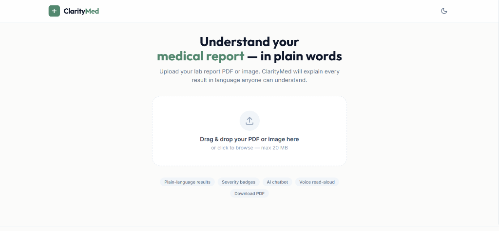
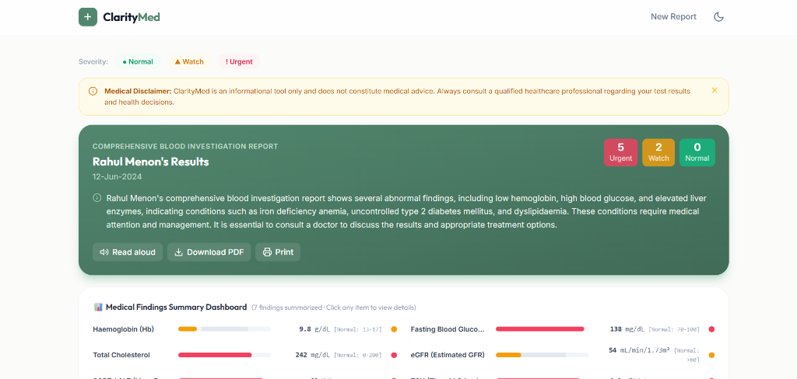
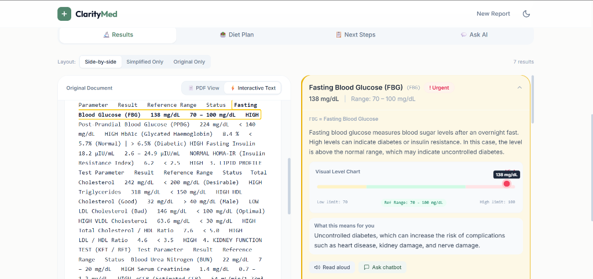
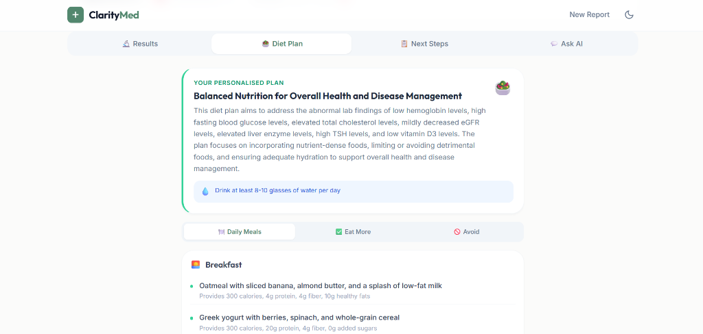
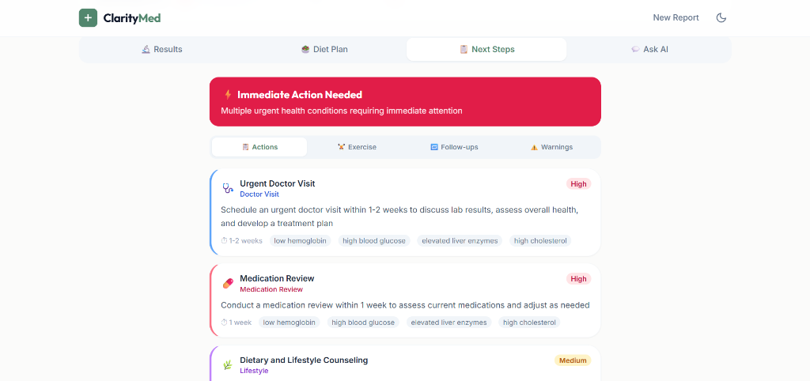
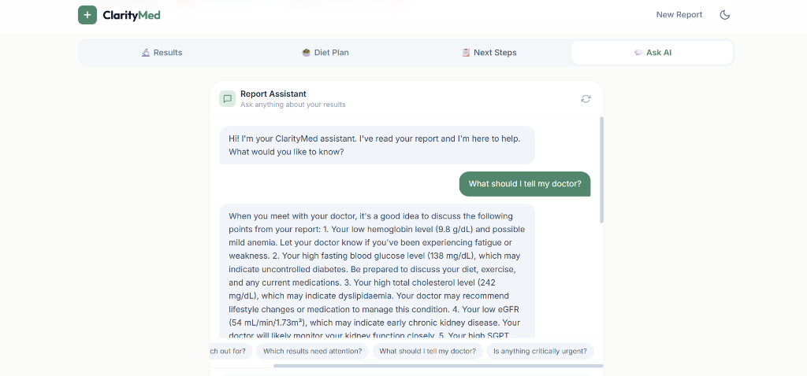
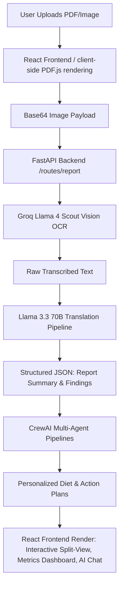

# ClarityMed — AI-Powered Clinical Report Simplifier & Patient Dashboard

An engineering-focused full-stack web application designed to bridge the gap between complex clinical terminology and patient health literacy. **ClarityMed** takes structured/scanned medical laboratory reports (PDFs, images) and parses, transcribes, and simplifies them into patient-friendly, interactive, and actionable dashboards.

---

## 🖥️ Demo & User Interface

#### 1. Intuitive Document Upload & Ingestion
A distraction-free, responsive landing page featuring drag-and-drop document uploads supporting standard PDFs, scanned documents, and images (PNG, JPEG).


#### 2. Comprehensive Clinical Metrics Dashboard
An aggregated dashboard displaying patient name, report date, type of report, and quick-glance status counts tracking the severity (Urgent, Watch, Normal) of the parsed biomarkers.


#### 3. Bidirectional Interactive Split-View
A synchronized side-by-side pane separating the original report text and simplified findings. Selecting text or parameter rows on the original sheet automatically scrolls to and expands the matching explanatory card on the right, and vice-versa. Includes visual sliding gauge charts mapping patient values against normal reference ranges.


#### 4. Personalized Agentic Diet Planner
A multi-agent nutritional counseling planner compiling Daily Meal plans (breakfast, lunch, dinner, snacks), recommended foods, foods to avoid, and hydration regimens based on specific abnormal biomarkers.


#### 5. Clinical Recommendations & Exercise Action Plan
Evidence-based recommendations indicating clinical visit urgency, follow-up tests, exercise recommendations, and critical warning signs to monitor.


#### 6. Interactive AI Report Assistant
An interactive conversational chatbot interface powered by Llama 3.1 8B, allowing patients to ask follow-up questions about their specific laboratory results and retrieve tailored patient education. Includes context-aware suggested query prompts.


---

## ⚙️ Core Architecture & Engineering Highlights



### 1. Multimodal Document Parsing & OCR Pipeline
* **Visual PDF Processing**: Client-side rendering pipeline utilizing `pdf.js` converts pages of scanned PDFs into high-resolution base64 data URLs.
* **Multimodal OCR**: Images are dispatched to a FastAPI backend where Groq's multimodal `meta-llama/llama-4-scout-17b-16e-instruct` model performs high-speed OCR to transcribe raw clinical text verbatim.

### 2. Asynchronous Fault-Tolerant Translation Engine
* **Structured Extraction**: Transcribed reports are passed through a translation pipeline to convert unstructured clinical tables into structured, valid JSON matching a strict Pydantic model.
* **Fallback Chain Routing**: Implements a robust fallback chain starting with `llama-3.3-70b-versatile` and falling back sequentially to `llama-3.1-8b-instant`, `openai/gpt-oss-20b`, and `openai/gpt-oss-120b` to handle rate limits or API disruptions gracefully.

### 3. Bidirectional Interactive UI Synchronization
* **Sync Mechanisms**: The split-view interface aligns parsed findings directly to original segments of the lab report using precise substring matching.
* **Interactive Linking**: Click events on either pane execute scroll-to-view DOM bindings, instantly highlighting the corresponding partner card to ensure context is never lost.

### 4. Agentic Clinical Decision Support (CrewAI)
The application leverages multi-agent pipelines powered by **CrewAI** and `meta-llama/llama-4-scout-17b-16e-instruct` to automate complex clinical reasoning:
* **Diet Pipeline** (`/api/diet/generate`): 
  * `NutritionAnalyst` reads parsed findings and identifies nutritional implications of abnormal markers.
  * `MealPlanner` structures comprehensive daily meal logs, food lists, and hydration targets.
  * `DietReviewer` performs schema verification to output strict JSON matching frontend component contracts.
* **Actions Pipeline** (`/api/actions/generate`):
  * `ClinicalAdvisor` determines care urgency, recommending doctor visits and specific laboratory checkups.
  * `FitnessCoach` generates safe exercise plans corresponding to the patient's physical state.
  * `LifestyleCoordinator` merges recommendations, adding lifestyle adjustments and red-flag symptoms.
  * `ActionFormatter` validates and compiles the final structured JSON response.

### 5. Multimodal Interface Extensions
* **Whisper Audio Integration**: Integrates Web Audio recording on the client and passes base64 audio payload to Groq's `whisper-large-v3` API for near-instant speech-to-text queries.
* **Web Speech API**: Integrates native client-side Text-to-Speech (TTS) to provide read-aloud support for simplified findings.

### 6. Security, Privacy & HIPAA Awareness
* **Zero Persistence**: Operating model is fully stateless; no Patient Health Information (PHI) is written to databases or file systems. All data is processed in-memory per request.
* **Secure Key Management**: The Groq API key is maintained strictly in the FastAPI environment (`server/.env`). The React client communicates with the server via backend proxy routes (`/api/*`), shielding private credentials from public exposure.

---

## 🛠️ Tech Stack

* **Frontend**: React (Vite), TailwindCSS, PDF.js, Web Speech API.
* **Backend**: FastAPI (Python), Uvicorn, Pydantic, HTTPX.
* **AI & Orchestration**: CrewAI, Groq SDK (Llama 3.3 70B, Llama 3.1 8B, Llama 4 Scout 17B, Whisper Large V3).
* **DevOps**: Docker (Multi-stage build).

---

## 📁 Repository Structure

```
ClarityMed/
├── server/                    ← Python / FastAPI (Backend proxy & AI pipelines)
│   ├── main.py                ← FastAPI application configuration & initialization
│   ├── groq_client.py         ← Groq API wrapper & JSON parse handler
│   ├── requirements.txt       ← Python backend dependency manifest
│   ├── .env.example           ← Environment template (contains GROQ_API_KEY)
│   └── routes/
│       ├── report.py          ← Report translation, image OCR & extraction
│       ├── chat.py            ← Llama 3.1 interactive follow-up chatbot
│       ├── diet.py            ← 3-Agent CrewAI nutrition pipeline
│       ├── actions.py         ← 4-Agent CrewAI clinical recommendations pipeline
│       └── audio.py           ← Whisper-large-v3 transcription proxy
├── client/                    ← React + Vite (Frontend SPA)
│   ├── src/
│   │   ├── utils/api.js       ← API fetch client pointing to backend proxy
│   │   └── components/
│   │       ├── DietPlanner.jsx     ← Personalised diet visualizer
│   │       ├── NextActions.jsx     ← Action plan visualizer
│   │       ├── FindingCard.jsx     ← Explanatory laboratory result cards
│   │       └── ReportView.jsx      ← Interactive split-pane workspace
├── screenshots/               ← Project demo images
└── Dockerfile                 ← Multi-stage production container build
```

---

## 🚀 Quick Start

### Prerequisites
* **Python**: 3.11+ (Check with `python --version`)
* **Node.js**: LTS version (Check with `node -v`)

### Step 1: Clone & Configure Credentials
1. Obtain a free Groq API key at [console.groq.com](https://console.groq.com/).
2. Navigate to the `server` directory and copy the environment configuration file:
   ```bash
   cd server
   cp .env.example .env
   ```
3. Open `server/.env` and replace the placeholder with your Groq API key:
   ```env
   GROQ_API_KEY=gsk_your_actual_key_here
   ```

### Step 2: Local Development Environment

You can start both backend and frontend servers simultaneously from the root directory:

```bash
# From the root directory:
npm install        # Installs concurrently dependency
npm run dev        # Starts both FastAPI (port 3001) and React Vite (port 5173)
```
Open **[http://localhost:5173](http://localhost:5173)** in your browser to interact with the application.

*Manual Execution:*
* **FastAPI Server**: Run `python main.py` inside `server/` (runs on `http://localhost:3001`).
* **Vite Frontend**: Run `npm run dev` inside `client/` (runs on `http://localhost:5173`).

---

## 🐳 Production Deployment & Containerization

### Docker Deployment
The project is containerized using a multi-stage Docker build to optimize image size and build speeds. 
1. **Stage 1 (Frontend Builder)**: Installs npm packages and runs Vite production compilation (`npm run build`).
2. **Stage 2 (FastAPI Runtime)**: Installs Python requirements, copies backend scripts, and copies the static assets from Stage 1 into `client/dist`.

To build and run the production-grade image locally:
```bash
# Build the Docker image
docker build -t claritymed .

# Run the container (injecting environment variables)
docker run -p 8080:8080 -e GROQ_API_KEY=gsk_your_key_here claritymed
```
The application will be served at `http://localhost:8080`.
